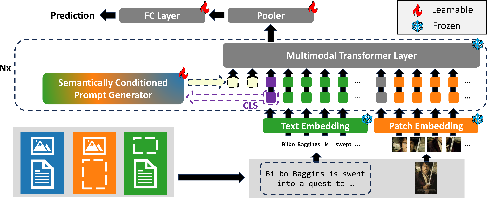

# Improving Multimodal Prompting with Missing Modalities for Visual Recognition (CVPR 2024)
Official PyTorch implementaton of CVPR 2024 paper "Improving Multimodal Prompting with Missing Modalities for Visual Recognition".  

## Introduction
This paper advances the domain of multimodal prompting within visual recognition frameworks, specifically when dealing with absent modalities. It introduces two principal contributions: the demonstration that modality-agnostic prompts autonomously adjust to diverse scenarios of missing modalities; the introduction of a novel module called SCP, designed to produce tailored prompts for each distinct sample to enhance overall system performance. This module exploits the data encapsulated by the [CLS] token to query a collection of trainable keys, which, in turn, facilitate the acquisition of trainable values via a conventional attention mechanism. Notably, this module is distinguished from preceding methodologies by its capacity to self-adjusting to both the missing modality scenario and the semantic context of the input, w/o prior knowledge about the specific missing modality and the number of modalities. Through rigorous experimentation, we prove the effectiveness of the proposed prompt learning framework, demonstrating enhanced performance across a spectrum of missing-modality cases, while preventing the fine-tuning of the whole transformer backbone. The code is publicly available.

<div align="center">
  
</div>

## Usage
### Enviroment
#### Prerequisites
Python = 3.7.13

Pytorch = 1.10.0

CUDA = 11.3

#### Other requirements
```
pip install -r requirements_local.txt
```

### Prepare Dataset
We use three vision and language datasets: [MM-IMDb](https://github.com/johnarevalo/gmu-mmimdb), [UPMC Food-101](https://visiir.isir.upmc.fr/explore), and [Hateful Memes](https://ai.facebook.com/blog/hateful-memes-challenge-and-data-set/). Please download the datasets by yourself. We use `pyarrow` to serialize the datasets, the conversion codes are located in `vilt/utils/wirte_*.py`. Please see `DATA.md` to organize the datasets, otherwise you may need to revise the `write_*.py` files to meet your dataset path and files. Run the following script to create the pyarrow binary file:
```
python make_arrow.py --dataset [DATASET] --root [YOUR_DATASET_ROOT]
```

### Evaluation (SPC)
```
python run_main.py with data_root=<ARROW_ROOT> \
        num_gpus=<NUM_GPUS> \
        num_nodes=<NUM_NODES> \
        per_gpu_batchsize=<BS_FITS_YOUR_GPU> \
        <task_finetune_mmimdb or task_finetune_food101 or task_finetune_hatememes> \
        load_path=<MODEL_PATH> \
        exp_name=<EXP_NAME> \
        prompt_type=<PROMPT_TYPE> \
        test_ratio=<TEST_RATIO> \
        test_type=<TEST_TYPE> \
        test_only=True \
        model_name=ViLTransformerSS_QKV_ps
            
```

### Train and Evaluate (SPC)
1. Download the pre-trained ViLT model weights from [here](https://github.com/dandelin/ViLT.git).

2. Start to train.
```
python run_main.py with data_root=<ARROW_ROOT> \
        num_gpus=<NUM_GPUS> \
        num_nodes=<NUM_NODES> \
        per_gpu_batchsize=<BS_FITS_YOUR_GPU> \
        <task_finetune_mmimdb or task_finetune_food101 or task_finetune_hatememes> \
        load_path=<PRETRAINED_MODEL_PATH> \
        exp_name=<EXP_NAME> \
        model_name=ViLTransformerSS_QKV_ps
```

### Evaluation (Agnostic)
```
python run_main.py with data_root=<ARROW_ROOT> \
        num_gpus=<NUM_GPUS> \
        num_nodes=<NUM_NODES> \
        per_gpu_batchsize=<BS_FITS_YOUR_GPU> \
        <task_finetune_mmimdb or task_finetune_food101 or task_finetune_hatememes> \
        load_path=<MODEL_PATH> \
        exp_name=<EXP_NAME> \
        prompt_type=<PROMPT_TYPE> \
        test_ratio=<TEST_RATIO> \
        test_type=<TEST_TYPE> \
        test_only=True \
        model_name=ViLTransformerSS_embedding_agnostic \
        prompt_length=16 \
        prompt_layers = [0,1,2,3,4,5]
            
```

### Train and Evaluate (Agnostic)
1. Download the pre-trained ViLT model weights from [here](https://github.com/dandelin/ViLT.git).

2. Start to train.
```
python run_main.py with data_root=<ARROW_ROOT> \
        num_gpus=<NUM_GPUS> \
        num_nodes=<NUM_NODES> \
        per_gpu_batchsize=<BS_FITS_YOUR_GPU> \
        <task_finetune_mmimdb or task_finetune_food101 or task_finetune_hatememes> \
        load_path=<PRETRAINED_MODEL_PATH> \
        exp_name=<EXP_NAME> \
        model_name=ViLTransformerSS_embedding_agnostic \
        prompt_length=16 \
        prompt_layers = [0,1,2,3,4,5]
```


## Acknowledgements
This code is based on [ViLT](https://github.com/dandelin/ViLT.git) and [MAP](https://github.com/YiLunLee/missing_aware_prompts).
